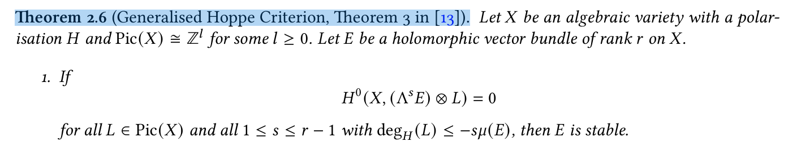

- 
- Recall:
	- The first Chern class is $c_1(\mathcal{E})=\sum_{i=1}^{16}(m_{i,1}+m_{i,2})[E_i]$.
	- The second Chern class is $c_2(\mathcal{E})=-2\sum_{i=1}^{16}m_{i,1}m_{i,2}$.
	- The ample divisor is $H = nh - \sum_{i=1}^{16} E_i$, where $h=\pi^*h_0$.
	- The Picard group is rationally generated by the 16 $E_i$'s and push-pull of $\text{Pic}(A)$. So $h$ is nef.
	- The slope is $\mu(\mathcal{E}) = \sum_{i=1}^{16} (m_{i,1} + m_{i,2})$.
- ----
- Write $L=\pi^*V + \sum_{i=1}^{16} \lambda_i E_i$.
	- The condition $\deg_H(L)\leq-\mu(E)$ becomes $2\sum\lambda_i \leq -\sum_{i=1}^{16}(m_{i,1}+m_{i,2})$.
- [[Bounding Hoppe check: one idea that didn't quite work]]
- ---
- Suppose that $\mathcal{L}$ is a line bundle such that $\mathcal{E}\otimes\mathcal{L}$ has a global section.
- Then $\mathcal{L}^{-1} \hookrightarrow \mathcal{E}$ as a subsheaf.
- Try to bound the self-intersection $\mathcal{L}^2$ as follows.
- ### Step 1
- Take the saturation of $\mathcal{L}^{-1}$ in $\mathcal{E}$, call it $\mathcal{M}$. Then $\mathcal{Q}:=\mathcal{E}/\mathcal{M}$ is torsion-free.
- Claim. $\mathcal{M}$ is an invertible sheaf.
	- Proof. We first recall [the following bound:]([[Bound on homological dimension of (torsion-free) sheaves on regular scheme]])
	- $$\operatorname{hd}(\mathcal{Q}) \leq \dim(X) - 1 = 1.$$
	- Then, from the SES $0\to\mathcal{M}\to\mathcal{E}\to\mathcal{Q}\to0$, [we easliy get](https://stacks.math.columbia.edu/tag/065S) $\operatorname{pd}(\mathcal{M})\leq 0$.
	- i.e., $\mathcal{M}$ is locally free. QED
- Thus we can replace $\mathcal{L}$ by $\mathcal{M}^{-1}$ in the Hoppe check! In the following we will bound $\mathcal{M}$, as it is impossible to bound $\mathcal{L}^2$ (this problem can be seen by the next section).
- ### Step 2
- Claim. We have $\mathcal{M}=\mathcal{L}^{-1}(D)$ for some effective divisor $D$.
	- Proof. This is because we have an inclusion of line bundles
	- $$\mathcal{L}^{-1} \hookrightarrow \mathcal{M}$$
	- Which gives us a line bundle $\mathcal{L\otimes M}$ equipped with a regular (in the sense of locally not being a zero-divisor, but since we're over a regular integral scheme this is just the same as non-zero) section, that is, [the same as](https://stacks.math.columbia.edu/tag/01X0) an effective Cartier divisor $D$.
	- $$\mathcal{L\otimes M \simeq O}(D)$$
	- The result follows. QED
- The Chern class is $c_1(\mathcal{M})=c_1(\mathcal{L}^{-1})+c_1(\mathcal{O}(D))=-c_1(\mathcal{L})+[D]$.
- Then $\deg_H(\mathcal{M}) \geq -\deg_H(\mathcal{L}) \geq \mu(\mathcal{E})$.
- ### Step 3
- Claim. $\mathcal{Q}^D$ is locally free.
	- Proof. This follows from Huybrechts-Lehn, Proposition 1.1.10. Details:
	- Denote for this proof $\mathcal{F}:=\mathcal{Q}^D$, which satisfies condition 2'). By 4') of the Proposition, $\mathcal{F}$ satisfies Serre's condition $S_{2,0}$. Since we're on a surface, this simply imples
	- $$\operatorname{depth}(\mathcal{F}_x) \geq \dim(\mathcal{O}_{X,x}), \;\; \forall x\in X.$$
	- By [Auslander–Buchsbaum formula]([[Depth of module]]), we see that this is an equality and $\operatorname{hd}(\mathcal{F})=0$. QED
- Note: this argument also works for the algebraic dual $\mathcal{Q}^\vee$.
- Claim. We have $\mathcal{Q} \simeq \mathcal I_Z \otimes \mathcal{Q}^{DD}$, where $Z$ is either empty or has dimension $0$.
	- Proof. This also follows from Huybrechts-Lehn, Proposition 1.1.10. Details:
	- By definition, $\mathcal{Q}$ is torsion-free. So it satisfies condition 1). By condition 4), we get a SES
	- $$0 \to \mathcal{Q} \to \mathcal{Q}^{DD} \to \mathcal{T} \to 0$$
	- By condition 3), $\mathcal{Q}$ satisfies Serre's condition $S_{1,0}$. With the same argument as above, this implies that the set of singular points $\{x\in X:\operatorname{dh}(\mathcal{Q}_x)\neq0\}$ has codimension $\geq2$.
	- At every point $x$ where $\mathcal{Q}_x$ is free, $\mathcal Q_x\longrightarrow\mathcal Q_x^{DD}$ is an isomorphism. Thus $\operatorname{dim}(\mathcal{T})=0$.
	- We tensor the sequence with $\mathcal{Q}^D\otimes\omega_X^{-1}\simeq(\mathcal{Q}^{DD})^{-1}$. This gives
	- $$0 \to \mathcal{Q\otimes Q}^D\otimes\omega_X^{-1} \to \mathcal{O}_X \to \mathcal{T\otimes Q}^D\otimes\omega_X^{-1} \to 0$$
	- Let $\mathcal{I}_Z:=\mathcal{Q}\otimes\mathcal{Q}^D\otimes\omega_X^{-1}$, then $Z$ has dimension $0$. The result follows. QED
- Note: These statements are written in loc. cit. Example 1.1.16.
- Chern classes. For the ideal sheaf $\mathcal{I}_Z$, we have
- $$c(\mathcal{I}_Z) = 1 + [Z]$$
- ### Step 4
- First we compute the Chern classes of $\mathcal{Q}$. It's a tensor product, so we use the Chern character,
- $$\ch(\mathcal F) = \operatorname{rk}(\mathcal{F}) + c_1(\mathcal{F}) + \frac{1}{2}(c_1^2-2c_2)$$
- We have $\ch(\mathcal{Q})=(1-[Z])(1+\alpha+\frac{1}{2}\alpha^2)$, so $c_1(\mathcal{Q})=\alpha$ and $c_2(\mathcal{Q})=[Z]$, where $\alpha:=c_1(\mathcal{Q}^{DD})$.
- From the SES
- $$0 \to \mathcal{M} \to \mathcal{E} \to \mathcal{Q} \to 0$$
- We get the equations
- $$c_1(\mathcal{E}) = c_1(\mathcal{M}) + \alpha,$$
- $$c_2(\mathcal{E}) = c_1(\mathcal{M})\alpha + [Z].$$
- We get $$0 \leq [Z] = c_2(\mathcal{E}) - c_1(\mathcal{M})(c_1(\mathcal{E})-c_1(\mathcal{M})) = \mathcal{M}^2 - c_1(\mathcal{E}).\mathcal{M} + c_2(\mathcal{E}).$$
- ### Step 5
- Write $N:=c_1(\mathcal M)-\frac{1}{2}c_1(\mathcal{E})=uH+R$ where $R\in H^\bot$.
- Here $N.H=uH^2=(c_1(\mathcal M)-\frac{1}{2}c_1(\mathcal{E})).H\geq0$ by Step 2.
- By the Hodge index theorem (Hartshorne V.1.9), $R^2\leq0$.
- We have
- $$N^2=u^2H^2+R^2 \geq \frac{1}{4}c_1(\mathcal{E})^2 - c_2(\mathcal{E}) =: \xi.$$
- Our main goal is now to bound $N$.
- ---
- ### Step 6
- Next idea: Find curves that intersect positively with the exceptional curves and restrict to them.
- Find a bulk curve by considering $Y=A/\iota$.
- Take some large $m$ s.t. $mh_0$ is very ample on $Y$. Let $j:Y \hookrightarrow \mathbb P^N$ s.t. $mh$ is the pullback of the hyperplane divisor. Since $Y$ is a projective variety, hence proper, $j$ is a closed embedding.
- By Bertini's theorem (Hartshorne II.8.18 and the remark after), there is a hyperplane in $\mathbb P^N$ whose intersection with $j(Y)$ is non-singular.
- Hence $mh_0$ is represented by a non-singular codim $1$ subvariety, whose strict transform in $X$ is a curve $C$ not intersecting any of the $E_i$.
- We have by assumption $\mathcal{M}|_C\hookrightarrow\mathcal{E}|_C$. Since [[flat bundles are semistable]], $\mu(\mathcal{E}|_C)=0$ and $\mu(\mathcal M|_C)\leq\mu(\mathcal{E}|_C)$. By definition, $\mu(\mathcal M|_C)=c_1(\mathcal{M}|_C)$ since $h|_C$ is an ample divisor.
- Let $j:C\hookrightarrow X$. Then $c_1(\mathcal{M}|_C)=j^*c_1(\mathcal{M})$.
- By the projection formula, $j_*(j^*c_1(\mathcal{M})\cap[C])=c_1(\mathcal{M}).j_*[C]=m(M.h)$.
- So $m(M.h)\leq0$, and so $M.h\leq0$.
- Since $c_1(\mathcal{E}).h=0$, we have $N.h\leq0$.
- ### Step 7
- Let $s=N.h\leq0$, $t=N.H\geq0$.
- Let $p=h^2$, $q=H^2$, $r=h.H$, all $\geq0$.
- Denote the projection of $N$ to the $\langle h,H\rangle$-plane by $P:=ah+bH$.
- Let the Gram matrix $G=\begin{pmatrix}p&r\\r&q\end{pmatrix}$.
- Then $G\begin{pmatrix}a\\b\end{pmatrix}=\begin{pmatrix}s\\t\end{pmatrix}$ and
- $$P^2=\begin{pmatrix}a&b\end{pmatrix}G\begin{pmatrix}a\\b\end{pmatrix}=\begin{pmatrix}s&t\end{pmatrix}G^{-1t}\begin{pmatrix}s\\t\end{pmatrix}=\frac{qs^2-2rst+pt^2}{pq-r^2}.$$
-
- Since $q=(nh-\sum E_i)^2=n^2h^2-32\geq0$, $p=h^2>0$ and $r=h.H=nh^2$, we have $pq-r^2<0$.
- By Hodge index theorem,
- $$\xi \leq N^2 \leq P^2 \leq \frac{pt^2}{pq-r^2} \leq 0$$
- We obtain a bound on $t$,
- $$0 \leq t \leq \sqrt{\frac{pq-r^2}{p}\xi}$$
- ### Step 8
- For every value of $t$, there is only finitely many choices of $N$, because
- $$R^2 \geq \xi-u^2H^2=\xi-t^2/q$$
- And $R^2\leq0$ by the Hodge index theorm.
- This reduces the problem down to a finite check.