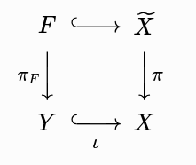

- We consider the a more general problem of finding algebraization of a vector bundle.
- Let $X$ be a smooth projective complex variety, $E$ be a rank $r$ analytic vector bundle.
- We need to find an algebraic $E_{alg}$ s.t. $E=E_{alg}^{an}$.
- # Part 1
- The goal of this part is to find $n$ so that $E(n)$ is globally generated.
- ### Step 1
- For $x\in X$, we have
- $$ 0 \to E(n)\otimes I_x \to E(n) \to E(n)_x \to 0$$
- so taking sheaf cohomology,
- $$H^0(X,E(n)) \to E(n)_x \to H^1(X,E(n)\otimes I_x)$$
- is exact. So $E(n)$ is globally generated if $H^1(X,E(n)\otimes I_x)=0$ for every $x$.
- The idea is clear: we want to apply [Nakano vanishing theorem]([[Vanishing theorems]]) to achieve this.
- ### Step 2
- However this is not immediately applicable because $I_x$ is not a vector bundle.
- To remedy this, consider the blow-up $\pi:\widetilde X \to X$ centered at the point $x$, with exceptional divisor $F$.
- Then $\pi_*\mathcal{O}(-F)=I_x$.
- We have the projection formula (Hartshorne ex III.8.3), we have
- $$R^q\pi_*(\mathcal{O}(-F)\otimes \pi^*E(n)) \simeq R^q\pi_*\mathcal{O}(-F)\otimes E(n).$$
- So the Leray spectral sequence can be written as
- $$E_2^{p,q}=H^p(X,R^q\pi_*\mathcal{O}(-F)\otimes E(n)) \Longrightarrow H^{p+q}(\widetilde X,\mathcal{O}(-F)\otimes\pi^* E(n)).$$
- Claim. $R^q\pi_*\mathcal{O}(-F)=0$ for all $q>0$.
	- Proof. Apply the derived image functor to the standard SES,
	- $$0 \to \mathcal{O}(-F) \to \mathcal{O}_{\widetilde X} \to \mathcal{O}_F \to 0$$
	- we get an exact sequence
	- $$\pi_*\mathcal{O}_{\widetilde X} \to \pi_*\mathcal{O}_F \to R^1\pi_*\mathcal{O}(-F) \to R^1\pi_*\mathcal{O}_{\widetilde X} \to R^1\pi_*\mathcal{O}_F \to \cdots$$
	- We need to show that the first arrow is surctive, and every higher image of $\mathcal{O}_{\widetilde X}$ and $\mathcal{O}_F$ vanishes.
	- We will put these computation in the following two steps.
- ### Step 3 Lemmas
- Lemma. If $f:X\to Y$ is a projective birational morphism of integral Noetherian schemes, $Y$ is normal, then $f_*\mathcal{O}_X=\mathcal{O}_Y$.
	- Proof. See (the proof of) Hartshorne III.11.4.
	- Remark: "projective" is to guarantee $f_*\mathcal{O}_X$ is coherent (Hartshorne III.8.8), so we can weaken it to "proper" if we use the more general theorem https://stacks.math.columbia.edu/tag/02O3.
- Lemma. Let $f:X\to Y$ be a projective birational morphism of regular schemes of finite type over a field. Then the higher direct images of $\mathcal{O}_X$ vanish.
	- Proof. See Theorem 1.1 of this paper https://arxiv.org/pdf/1404.1827.
- Corollary. Back to where we stopped in Step 2, we conclude that
- $$R^i\pi_*\mathcal{O}_{\widetilde X} = \begin{cases} \mathcal{O}_X, & i=0, \\ 0, & i>0. \end{cases}$$
- ### Step 4 Lemmas
- Lemma. Let $X$ be a non-singular variety and $\widetilde X$ be the blow-up centered at a non-singular closed subvariety $Y$, with exceptional divisor $F$. Then passing to some affine chart $U\simeq\operatorname{Spec}A$ of $X$, we have $F_U\simeq\mathbb{P}^{\text{codim}(Y,X)-1}_A$. Thus
- $$H^i(F,\mathcal{O}_F)=\begin{cases}\Gamma(X,\mathcal{O}_X),&i=0,\\0,&i>0.\end{cases}$$
	- Proof. By Hartshorne II.8.24, $F\simeq\mathbb{P}(\mathcal{I/I}^2)$ where the conormal sheaf $\mathcal{I/I}^2$ is locally free of rank $\text{codim}(Y,X)$. So we pass to a open of the conormal bundle, and apply the standard result about cohomology of the projective space.
- In this scenario, we have a commutative square 
  id:: 6a8b7de6-77a0-4ce1-bc34-62656a61fc7b
	- 
- Since $\iota$ is a closed immersion, we have
- $$R^i\pi_*\mathcal{O}_F = \iota_*R^i(\pi_F)_*\mathcal{O}_F.$$
- By Hartshorne III.8.5,
	- > Let $X$ be a Noetherian scheme, $f:X\to\operatorname{Spec}A$, then for any quasi-coherent sheaf $\mathcal{F}$ on $X$, we have $R^if_*\mathcal{F} = \widetilde{H^i(X,\mathcal{F})}.$
- we can easily compute $R^i\pi_*\mathcal{O}_F$.
- Back to where we stopped in Step 2, we conclude that
- $$R^i\pi_*\mathcal{O}_{F} = \begin{cases} \mathcal{O}_x, & i=0, \\ 0, & i>0. \end{cases}$$
- # Part 2
- ### Step 1
-