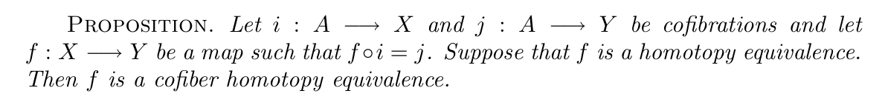
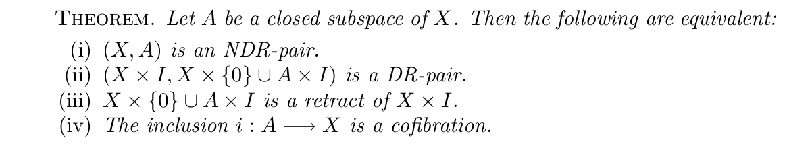

- Fix $X$ paracompact Hausdorff. Let $\mathcal{U}=\{U_i\}_{i\in I}$ be a locally finite good open cover (viz. all nonempty finite intersections are contractible), we have the nerve $N_\mathcal{U}$, which can be viewed as a simplicial set (or, a simplicial complex).
	- ref: Shastri
- **Theorem**. There is a homotopy equivalence $h_\mathcal{U}:X\to|N_\mathcal{U}|$.
- First, recall that the CW complex $|N_\mathcal{U}|$ has a cell for each non-degenerate simplex in $N_\mathcal{U}$. We get a map $\rho:|N_\mathcal{U}|\to\mathcal{P}(X)$. Define
  $$\mathcal{D}:=\mathcal{D}_\mathcal{U}=\{(a,x):x\in\rho(a)\}.$$
  This has projections $p,q$ to $N:=|N_\mathcal{U}|, X$ respectively.
- We proceed in two steps:
	- Step 1. There is a section $s$ of $q$ such that $s(X)\simeq X$ is a DR of $\mathcal{D}$. Thus $q$ is a homotopy equivalence.
	- Step 2. $\mathcal{D}$ is a deformation retract of $M(p)$. Thus $p$ is a homotopy equivalence.
- ### Step 1
- Pick $\theta_i$ a partition of unity subordinate to $\mathcal{U}$. Since $\theta_i(x)>0\Longleftrightarrow x\in\operatorname{supp}\theta_i$ holds for finitely many $i$, we have a map $\Theta:x\mapsto[j\mapsto\theta_j(x)]\in|N_\mathcal{U}|$ mapping $x$ to the simplex given by these $i$.
- Then $s:x\mapsto(\Theta(x),x)$ is a section of $q$ and we can check its continuity locally.
- It is clearly a deformation retract, as we can exhibit the homotopy
  $$H:\mathcal{D}\times I\to\mathcal{D},\quad ((a,x),t)\mapsto(t\Theta(x)+(1-t)a,x)$$ 
  because the simplex is convex.
- ### Step 2
- Let $\mathcal{D}^k=p^{-1}(N^{(k)})$ and $p^k:=p|_{\mathcal{D}^k}:\mathcal{D}^k\to N^{(k)}$.
- First we inductively show that for all $k\geq0$, $\mathcal{D}^k\cup M(p^{k-1})$ is a SDR of $M(p^k)$.
	- If $k=0$, $\mathcal{D}^0=\bigsqcup_i\{i\}\times U_i$, and $M(p^0)$ is the disjoint union of cones over the $U_i$. Since each $U_i$ is contractible, $(CU_i,U_i)$ is a SDR pair, see [[Cone over contractible base is SDR]]. Hence also $(M(p^0),\mathcal{D}^0)$ is a SDR pair.
	- If $k\geq1$, we can reduce to gluing a single $k$-cell $\sigma$ of $N$. Denote $|\sigma|$ also by $\sigma$ and $V:=U_\sigma$.
	- Now $\mathcal{D}=\sigma\times V$ and $p:\mathcal{D}\to\sigma$ is the first projection, hence $M(p)=\sigma\times CV$ and $M(p^{k-1})=\partial\sigma\times CV$. By the same reason, $(CV,V)$ and hence $(M(p^{k-1}),\partial\sigma\times V)$ are SDR pairs. Hence $\mathcal{D}$ is a SDR of $A:=\mathcal{D}\cup M(p^{k-1})$. Thus $A$ is contractible and $A\hookrightarrow M(p)$ is a homotopy equivalence.
	- We want to show that this is a SDR pair. By this result (May Chapter 6),
	- 
	- it suffices to show that $A\hookrightarrow M(p)$ is a cofibration. By another result (loc. cit.),
	- 
	- it suffices to show that $M(p)\times I$ retracts to $M(p)\times\{0\}\cup A\times I$. Expanding the definition, this amounts to the following construction.
		- Let $X,Y$ be spaces, then there is a retract (in fact, an SDR) from $CX\times CY\times I$ to 
		  :LOGBOOK:
		  CLOCK: [2026-02-15 Sun 16:03:05]
		  :END:
		  $X\times CY\times I \cup CX\times Y\times I \cup CX\times CY\times \{0\}$.
		- Proof. This is the same as pushing the unit cube $I^3$ onto three faces given by $x=0\vee y=0\vee z=0$, while keeping the *two* faces $x=1$ and $y=1$ invariant. This is easy: just push everything away from $(1,1,2)$ at unit speed. For $CX,CY$, apply this to their height.
- Now, we can patch these maps together by taking composition on